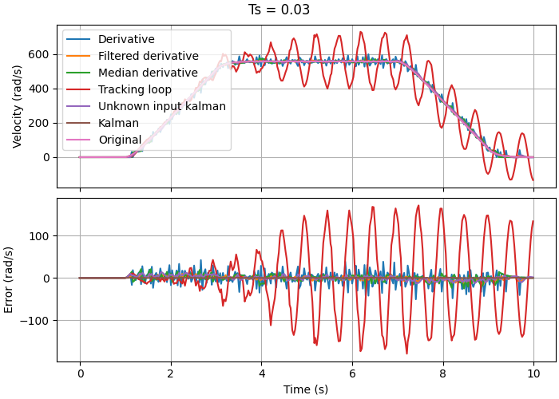
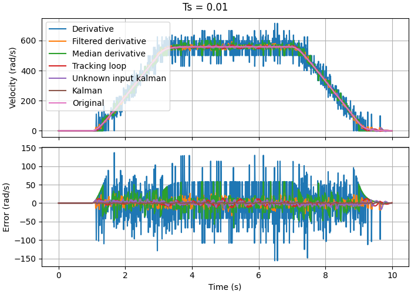
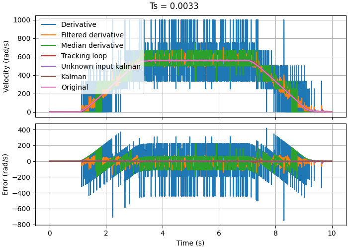

# Результаты работы

* Цели и задачи - см. [дорожную карту](roadmap.md)

## Реализованные программные модули

* [Иммитационная модель энкодера](../src/encoders)
* [Иммитационная модель электродвигателя](../src/motors)
* [Функции для моделирования линейных систем](../src/control)
* [Различные алгоритмы оценки скорости](../src/estimators)

## Рассмотренные алгоритмы оценки скорости

1. [Производная положения](../src/estimators/derivative_estimator.py)

$$\omega(t) = \frac{\Delta\theta(t)}{\Delta t(t)}$$

2. [Фильтрованная производная положения](../src/estimators/filtered_derivative_estimator.py)

$$\omega_{raw}(t) = \frac{\Delta\theta(t)}{\Delta t(t)}$$
$$\omega(t) = \omega_{raw}(t) * [0.2, 0.2, 0.2, 0.2, 0.2]$$

3. [Медиана производной положения](../src/estimators/median_derivative_estimator.py)

$\omega_{raw}(t) = \frac{\Delta\theta(t)}{\Delta t(t)}$

```
for t = 0..(T-k)
    omega[t] = median(omega_raw[t:t+k])
```

4. [Следящий алгоритм](../src/estimators/tracking_loop_estimator.py)

$$A = \begin{pmatrix} 0 & 1 \\ 0 & 0 \end{pmatrix}$$

$$\hat{x} = \begin{pmatrix} \hat{\theta} & \hat{\omega} \end{pmatrix}^T$$

$$\hat{\dot{x}}(t) = A\hat{x}(t) + B(\theta(t) - \hat{\theta}(t))$$

5. [Фильтр Калмана](../src/estimators/kalman_estimator.py)

В отличие от остальных алгоритмов, требует реализации математической модели
фильтруемеого объекта (в данном случае, двигателя)

Реализован в соответствии с [описанием на Википедии](https://en.wikipedia.org/wiki/Kalman_filter)

6. [Фильтр Калмана расширенного порядка](../src/estimators/unknown_input_kalman_estimator.py)

Аналогичен предыдущему фильтру по структуре, но также оценивает значение
входного сигнала (в данном случае, поступающего на двигатель напряжения)
и поэтому требует меньше входной информации

## Результаты работы фильтров

Проведена серия экспериментов, в каждой из которых:

1. На имитационную модель двигателя подавалась 
одинаковая функция напряжения $u(t)$ с определенным
шагом дискретизации $T_s$
2. Точность измерений времени и положения $t, \theta$ искуственно занижалась
3. Полученное положение $\theta(t)$ пропускалось через каждый из фильтров
4. Измеренное значение скорости $\hat{\omega}(t)$ сравнивалось с истинным $\omega(t)$

Ниже приведены графики работы всех фильтров с различными шагами дискретизации:





#### Сводная таблица со значениями среднеквадратичного отклонения (СКО) для каждого эксперимента:

| Алгоритм \ Шаг                             | $T_s=0.0033$ | $T_s=0.01$ | $T_s=0.03$ |
|--------------------------------------------|--------------|------------|------------|
| **Производная**                            | `136.56`     | `45.08`    | `15.37`    |
| **Производная с низкочастотным фильтром**  | `32.77`      | `9.97`     | `4.72`     |
| **Производная с медианой**                 | `66.79`      | `18.59`    | `7.15`     |
| **Следящий фильтр**                        | `3.96`       | `4.66`     | `81.95`    |
| **Фильтр Калмана**                         | `1.21`       | `0.69`     | `0.34`     |
| **Фильтр Калмана с расширением состояния** | `4.81`       | `4.61`     | `5.10`     |

*Чем меньше, тем лучше*

## Замечания

1. Точность алгоритмов с использованием производной обратно пропорциональна частоте дискретизации
2. Для фильтрации производной лучше всего себя показал низкочастотный фильтр
3. Следящий фильтр хорошо показал себя при большой частоте дискретизации. 
Однако, при $Ts>0.01$ ошибка получается аномально большой: вероятнее всего, это связано с неправильным
подбором параметров либо с невозможностью фильтра достаточно быстро реагировать на изменение состояния.
4. Во всех экспериментах лучше всего себя показал классический фильтр Калмана
5. Фильтр Калмана с расширенным состоянием также хорошо показал себя во всех экспериментах

## Выводы

1. В целом, каждый из выведенных алгоритмов успешно справляется с расчетом скорости с определенной точностью
2. В случаях, когда шаг дискретизации достаточно большой и модель системы не известна, рекомендуется
использовать фильтрованную производную
3. В случаях, когда шаг дискретизации достаточно маленький и модель системы не известна, рекомендуется
использовать следящий фильтр
4. В случаях, когда модель системы известна, при любом шаге дискретизации рекомендуется использовать 
фильтр Калмана с расширенным состоянием
5. В случаях, когда модель системы и поступающий на неё сигнал известны, рекомендуется использовать 
классический фильтр Калмана: Тогда точность будет наибольшей

